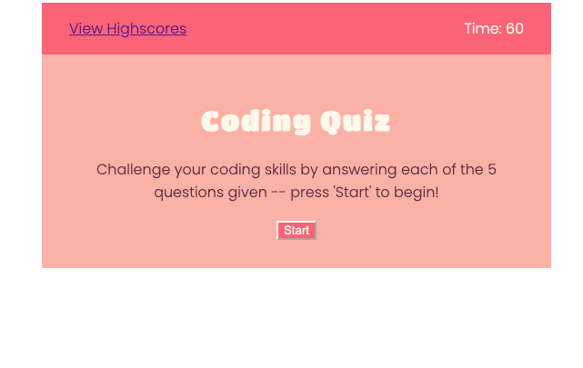

# Coding Quiz

## Description
This project was intended to create a basic quiz on coding that would log the initials and scores of the player. The intention was that the highscores be saved even if the user were to leave the page (this is currently not functioning -- see the Known Issues section). 

## Table of Contents

- [Installation](#installation)
- [Application Preview](#application-preview)
- [Known Issues](#known-issues)
- [Languages Used](#languages-used)
- [Important Links](#important-links)
- [Credits](#credits)
- [License](#license)
    - [MIT License](#mit-license)

## Installation

- Navigate to the 'clone' button on the github repository and use either SSH or HTTPS link to clone the repository to your computer.

- On your computer, navigate to the 'password-generator' directory and open the index.html file in your browser. 

## Application Preview

## Known Issues

- At the moment, the localStorage does not save on refresh; so the view highscores only works for the current session. Once the page is refreshed, the highscores are refreshed. 

## Languages Used

- HTML
- CSS
- Javascript

## Important Links

- [Github Repository](https://github.com/armaples/code-quiz)
- [Deployed Application](https://armaples.github.io/code-quiz)

## Credits
- [Professional README Guide](https://coding-boot-camp.github.io/full-stack/github/professional-readme-guide) 
- [Choose A License](https://choosealicense.com/licenses/mit/)

## License

### MIT License

Copyright (copy) 2022 Code Quiz - Alyssa Maples

Permission is hereby granted, free of charge, to any person obtaining a copy
of this software and associated documentation files (the "Software"), to deal
in the Software without restriction, including without limitation the rights
to use, copy, modify, merge, publish, distribute, sublicense, and/or sell
copies of the Software, and to permit persons to whom the Software is
furnished to do so, subject to the following conditions:

The above copyright notice and this permission notice shall be included in all
copies or substantial portions of the Software.

THE SOFTWARE IS PROVIDED "AS IS", WITHOUT WARRANTY OF ANY KIND, EXPRESS OR
IMPLIED, INCLUDING BUT NOT LIMITED TO THE WARRANTIES OF MERCHANTABILITY,
FITNESS FOR A PARTICULAR PURPOSE AND NONINFRINGEMENT. IN NO EVENT SHALL THE
AUTHORS OR COPYRIGHT HOLDERS BE LIABLE FOR ANY CLAIM, DAMAGES OR OTHER
LIABILITY, WHETHER IN AN ACTION OF CONTRACT, TORT OR OTHERWISE, ARISING FROM,
OUT OF OR IN CONNECTION WITH THE SOFTWARE OR THE USE OR OTHER DEALINGS IN THE
SOFTWARE.